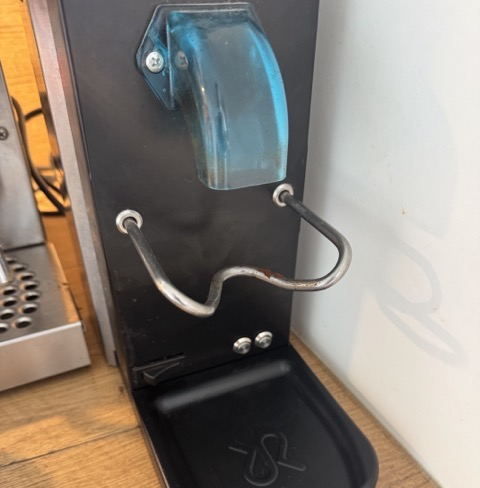
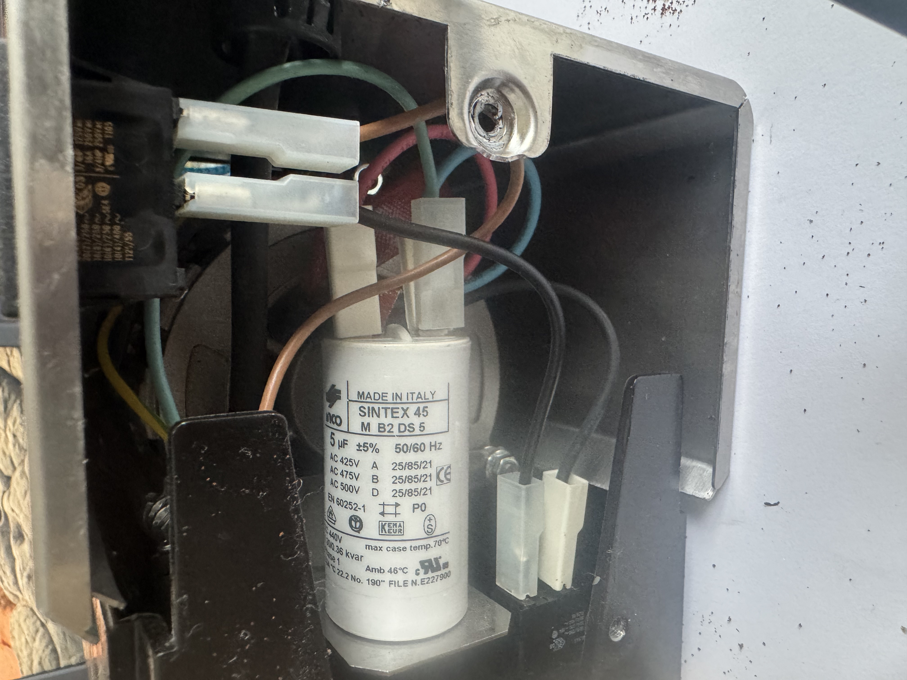
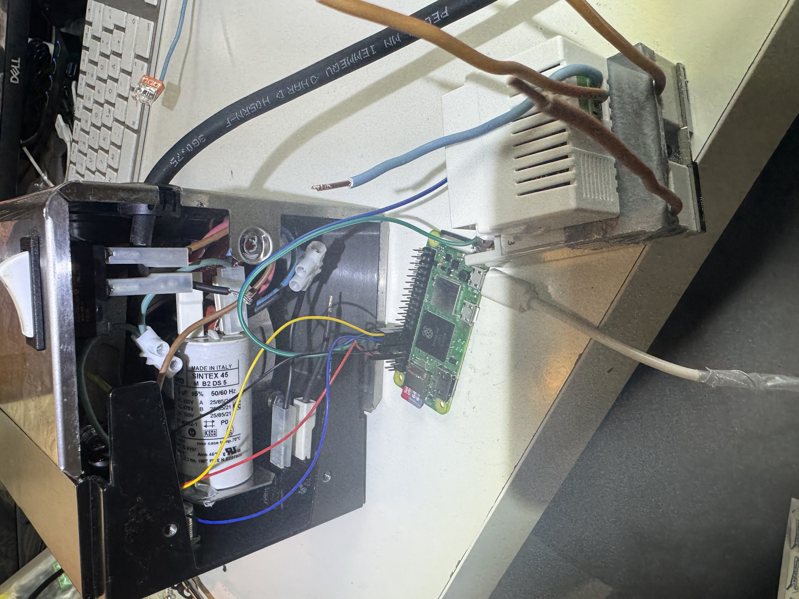
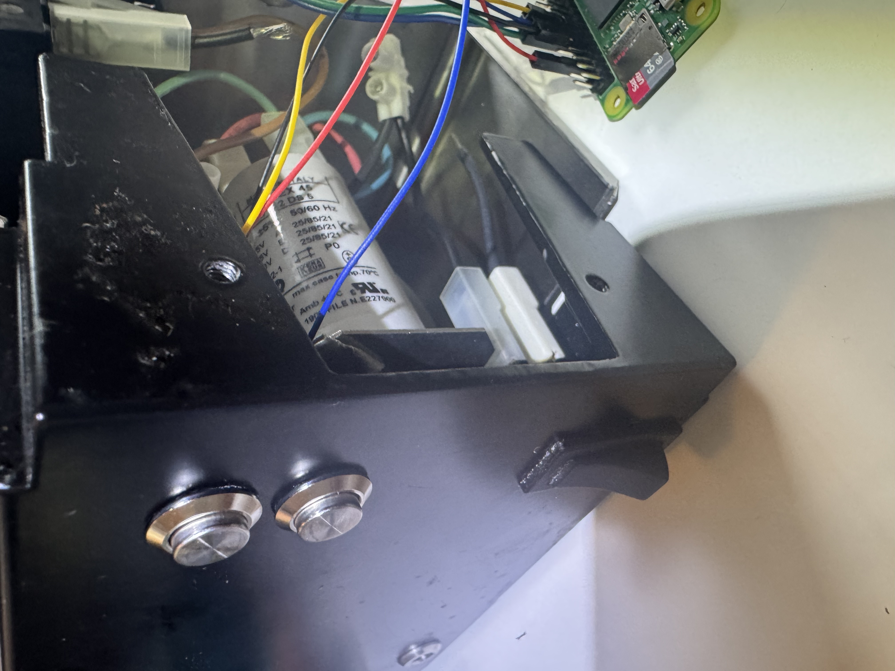
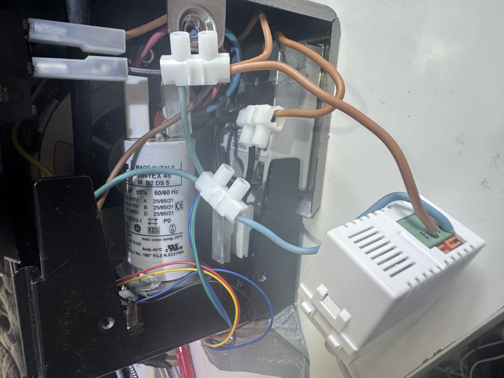
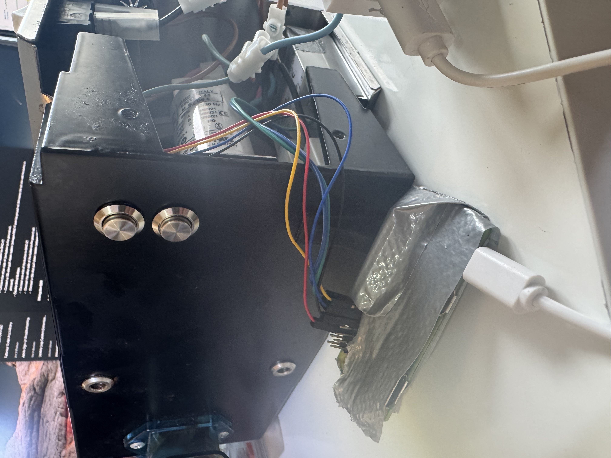
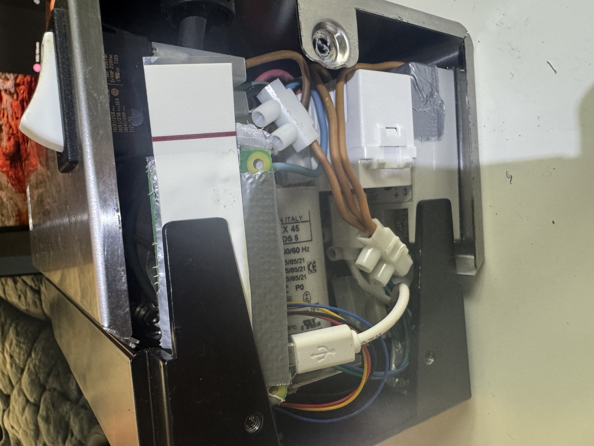
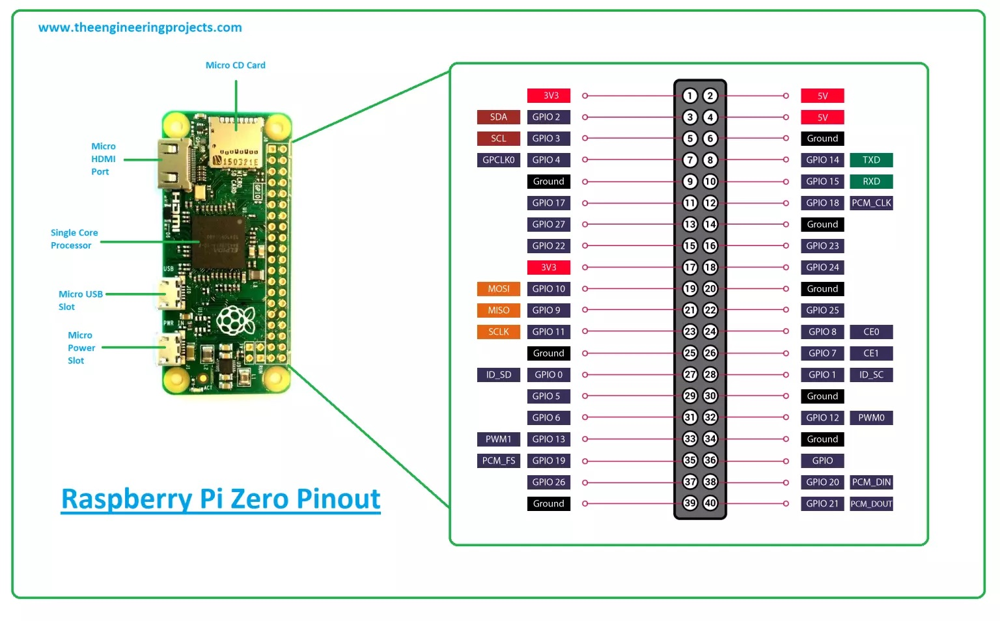

# grinder

DIY project to add timed grind buttons to the [Rancilio
Rocky](https://www.coffeeness.de/en/rancilio-rocky-review/) grinder.

| Rancilie Rocky | after modification |
|:-------------------------------------:|:-------------------------------------:|
|  |  |

## Description

Rancilio Rocky seems to be a nice device, it lasts me now over a decade without
problems but it has a major flaw, no way to carry out a timed grind. There are a
few other project out there like this, for me this approach was the most
feasible.

The basic idea is to use a [Raspberry Pi Zero
W](https://www.raspberrypi.com/products/raspberry-pi-zero-2-w/) and some
minimalistic electronics to get buttons that can be used to activate the grinder
for a software controlled amount of time.

## Features

- Control the grinder via physical buttons
- Adjust grind times via a web interface
- Safe and flexible control using GPIO and a Solid State Relay

## Safety First

Only attempt this project if you know what you are doing, we work with 220V
which is no place to make mistakes. Carry on at you own risk.

## Components and Tools

- [Raspberry Pi Zero
W + an SD Card](https://www.raspberrypi.com/products/raspberry-pi-zero-2-w/)
- [220V auf 5V 1A USB Interface](https://amzn.eu/d/07xP26XJ)
- [Drucktaster](https://amzn.eu/d/0fkwAuz7)
- [24 V-380 V SSR](https://amzn.eu/d/0aPBSthj)
- Some wires for 5V and 220V, some clamps and pin connectors, soldering equipment, and some tools for drilling metal

These linked components are, of course, only a suggestion and what I used for this project.

## Software Setup

Install a light weight [raspian](https://www.raspberrypi.com/software/) on the
SD-Card, I used their Imager tool, which worked great. Directly configure Wifi
and ssh when doing this.

Then login to your `grinder pi` and setup the software.

```bash
git clone https://github.com/guenthereder/grinder.git
cd grinder
python3 -m venv .venv
source .venv/bin/activate
pip install -r requirements.txt
````

Open `grinder_control.service` and adapt it to match your environment.

```bash
sudo cp grinder_control.service /etc/systemd/system
sudo systemctl daemon-reload
sudo systemctl start grinder_control
```

Optional 🙃

```bash
sudo cp motd /etc/
```

### Software Test

If everything is running you should be able to access the Grinder Timer Settings
via browser, just visit [http://pi-grinder.local](http://ginder.local) using the name you gave your pi.

## Assembly

I guess this project can work for many other ideas as well. For the Rocky one
can easily open it from the bottom with only three screws. Then the bottom plate
comes off an reveals what you can see in the first Showcase image.

### High Voltage

The Rocky does not contain much electronics, its a power button and a trigger
for the grinder. So we have to get our wires in between.
On my Rocky, the blue wire is the neutral one and the black wire (from the main
power switch) is the 220V phase.

We basically need to cut through three existing wires, clamp them back
together, and then attach to these clamps:

1. (black) 220V phase from the main power switch
2. (blue) neutral wire from the main power line
3. (black) 220V from the manual grind trigger to the motor driver

From [1] we connect to one side of the SSR and to one side of the 220V-to-5V USB Interface.
From [2] we connect to the second side of the 220V-to-5V USB Interface.
From [3] we connect to the second side of the SSR.

### DIY Tips

- Solder the cables onto the buttons in advance.
- Test the full setup without even opening the grinder, with, say a light bulb to be sure everything is working.
- Finding space for all components it finicky, take your time.
- Carefully check where to put the holes to be able to fit the buttons without having space issues inside.
- When everything is connected test again before re-assembly.

### Showcase

|  |  |  |
|:------------:|:------------:|:------------:|
|  |  |  |

### Hardware Connections

1. **Connect the Single Grind Button:**
   - One side to GPIO 17
   - The other side to GND
2. **Connect the Double Grind Button:**
   - One side to GPIO 27
   - The other side to GND
3. **Connect the SSR Control Side:**
   - Positive control terminal to GPIO 18
   - Negative control terminal to GND
4. **Connect the SSR Load Side:**
   - One load terminal to the live wire from the mains supply
   - The other load terminal to the live wire of the grinder

 

## Support

[](https://www.buymeacoffee.com/guenthereder)

## Warning

**Working with electricity can be dangerous. Ensure all high voltage
connections are handled with care and proper insulation. If you are not
experienced with electrical work, seek assistance from a qualified electrician.
Incorrect wiring can result in electric shock, fire, or damage to equipment.**