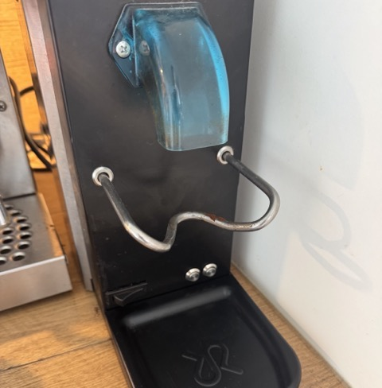
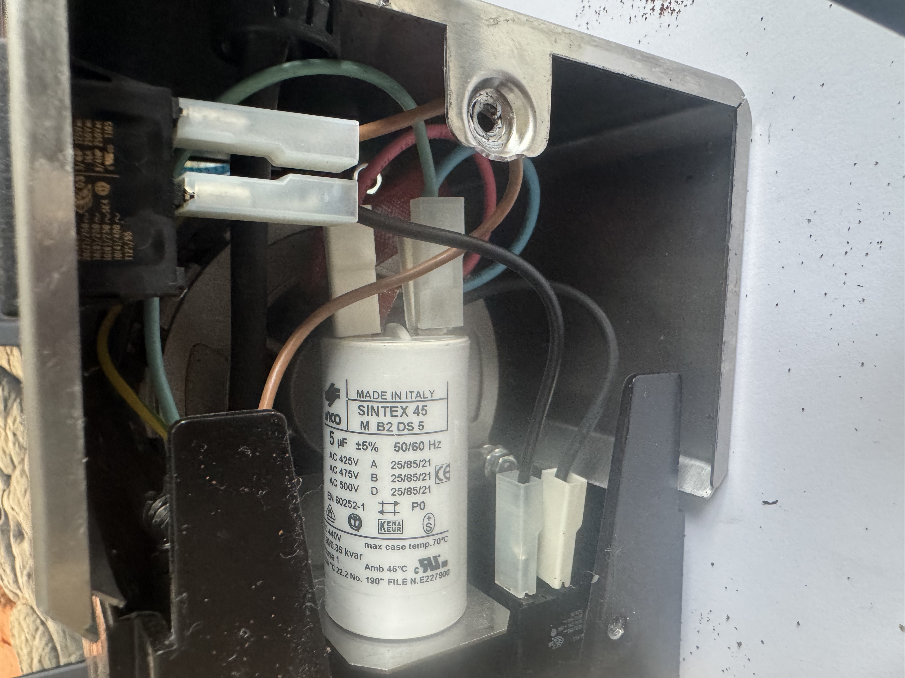
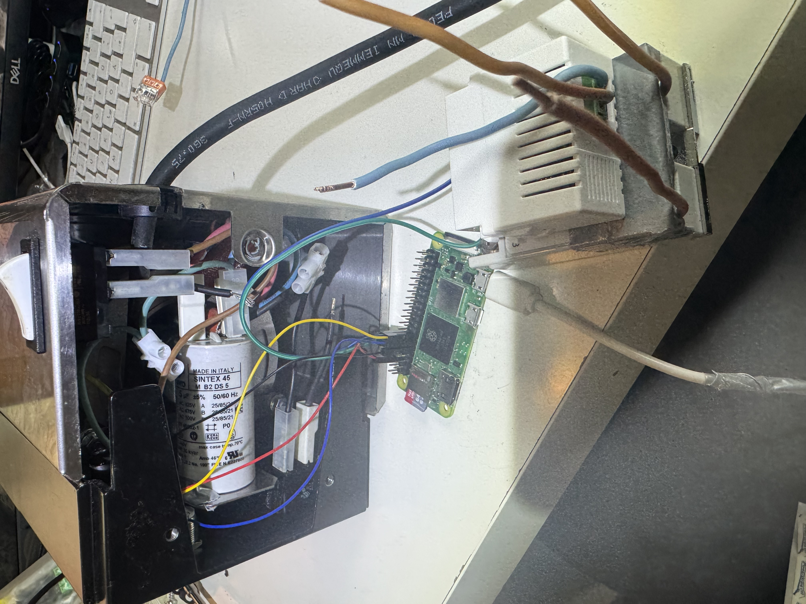
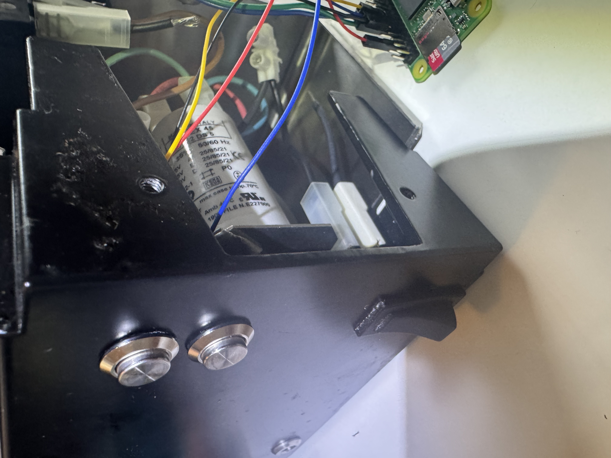
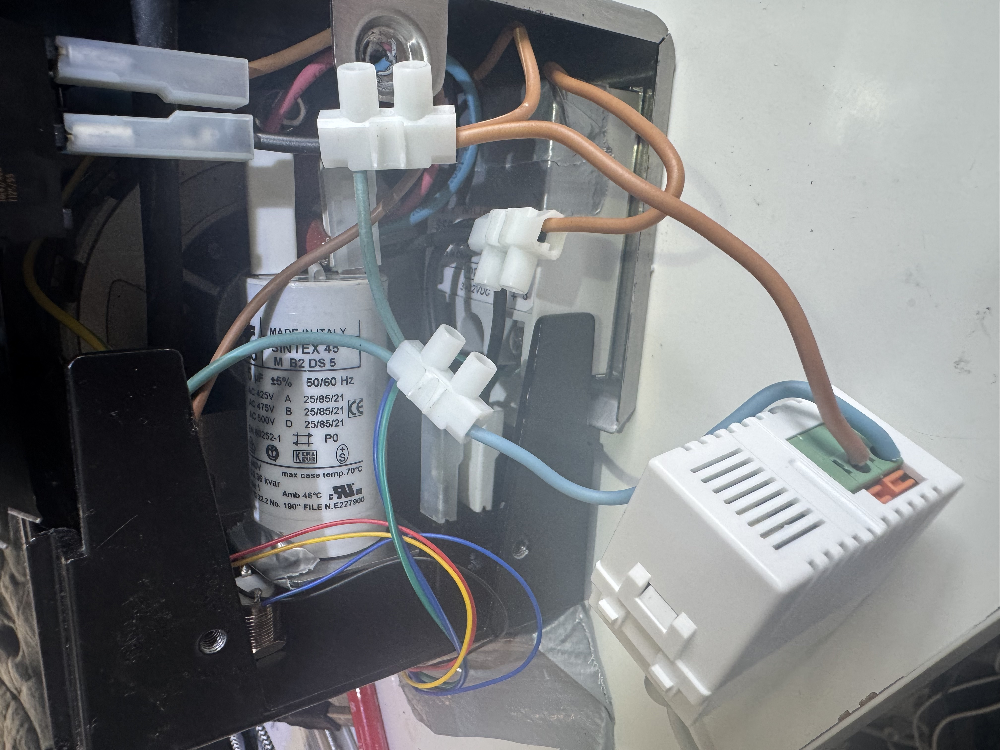
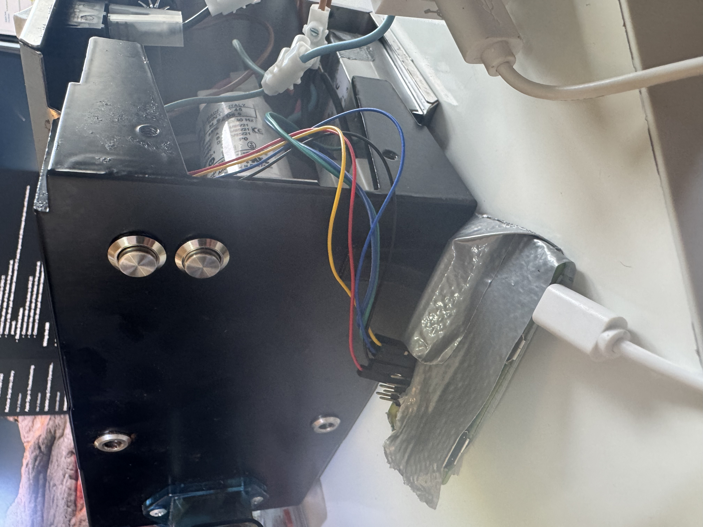
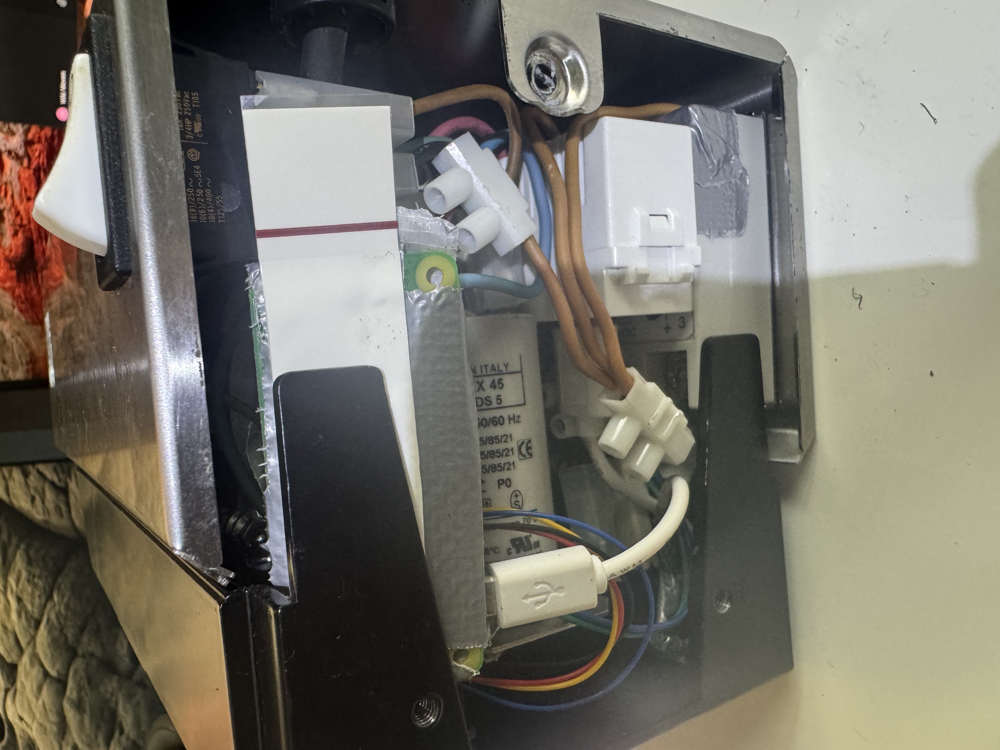
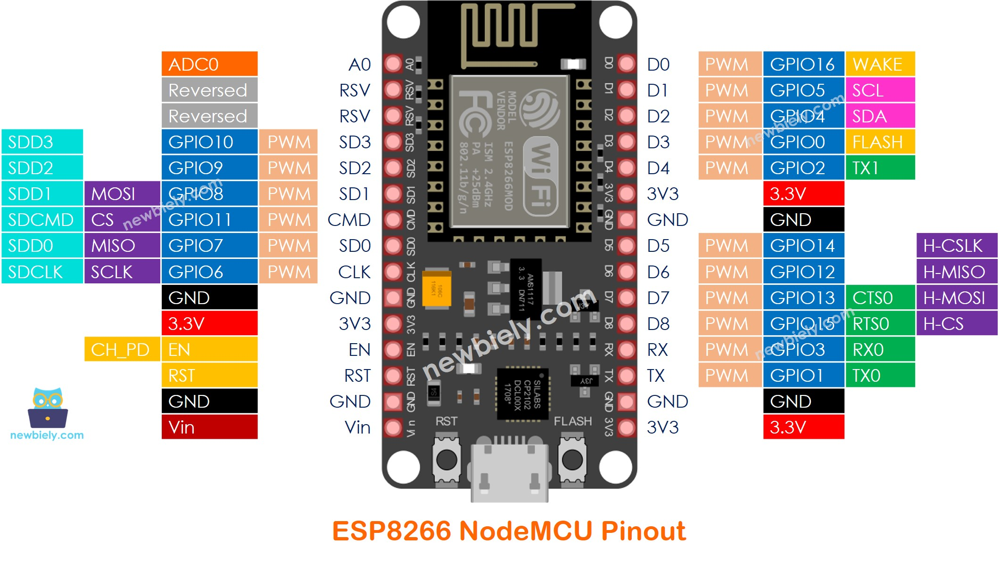

# grinder

DIY project to add timed grind buttons to a [Rancilio
Rocky](https://www.coffeeness.de/en/rancilio-rocky-review/) grinder.

| Rancilio Rocky | after modification |
|:-------------------------------------:|:-------------------------------------:|
|  |  |

## Description

The Rancilio Rocky seems to be a nice device, lasted me now over a decade without
problems but has a major flaw, there is no way to carry out a timed grind. There are a
few other projects out there like this, for me this approach was the most
feasible.

The basic idea is to use an [ESP8266 NodeMCU](https://en.wikipedia.org/wiki/NodeMCU)
running [ESPHome](https://esphome.io/) and some minimalistic electronics to get
buttons that activate the grinder for a software controlled amount of time.

> The first version of this project used a Raspberry Pi Zero W running
> `grinder_control.py` (still in this repo for reference). The NodeMCU replaces
> it: it boots in under a second, draws a fraction of the power, and has no SD
> card to corrupt on power loss.

## Features

- Control grinder via physical buttons (single / double shot)
- Pressing a button while grinding **stops** the grind
- Grind times adjustable in milliseconds (500–60,000 ms) via web interface or Home Assistant
- All grind logic runs on-device — works with Wi-Fi down
- Native [Home Assistant](https://www.home-assistant.io/) integration (auto-discovered via the ESPHome API)
- MQTT event on every grind for statistics
- Settings survive power cycles; firmware updates over the air (OTA)
- Safe and flexible control using a GPIO Solid State Relay, with a 90 s motor failsafe

## Safety First

Only attempt this project if you know what you are doing, we work with 220V
which is no place to make mistakes. Carry on at your own risk.

## Components and Tools

- ESP8266 NodeMCU dev board (4MB flash)
- [220V auf 5V 1A USB Interface](https://amzn.eu/d/07xP26XJ)
- [Drucktaster](https://amzn.eu/d/0fkwAuz7)
- [24 V-380 V SSR](https://amzn.eu/d/0aPBSthj)
- Some wires for 5V and 220V, some clamps and pin connectors, soldering equipment, some tools for drilling metal

These linked components are, of course, only a suggestion of what I used.

## Software

The firmware lives in [`esphome/grinder.yaml`](esphome/grinder.yaml).

```bash
git clone https://github.com/guenthereder/grinder.git
cd grinder

# install the esphome CLI (or: pip install esphome)
uv tool install esphome

# your Wi-Fi credentials (file is gitignored)
cp esphome/secrets.yaml.example esphome/secrets.yaml
$EDITOR esphome/secrets.yaml

# first flash over USB
esphome run esphome/grinder.yaml --device /dev/cu.usbserial-XXXX
```

Every later update works over the air, no USB access needed:

```bash
esphome run esphome/grinder.yaml --device grinder.local
```

### Software Test

If everything is running you should be able to access the grinder settings via
browser at [http://grinder.local](http://grinder.local) — grind times, manual
grind buttons, and a live debug log. If you run Home Assistant, the device is
auto-discovered as "Coffee Grinder" with the same controls.

## Assembly

I guess this project can work for many other grinders as well. For the Rocky one can
easily open the bottom with only three screws. Then the bottom plate
comes off and reveals what you see in the first Showcase image.

### High Voltage

The Rocky does not contain much electronics, a power button and a trigger for the
grinder. So we get our wires in between.
On the Rocky, the blue wire is the neutral one and the black wire (from the main
power switch) is the 220V phase.

We basically need to cut through three existing wires, clamp them back
together, with clamps:

1. (black) 220V phase from the main power switch
2. (blue) neutral wire from the main power line
3. (black) 220V manual grind trigger to the motor driver

From [1] we connect one side to the SSR and one side to the 220V-to-5V USB Interface.
From [2] we connect the second side of the 220V-to-5V USB Interface.
From [3] we connect the second side of the SSR.

DIY Tips

- Solder cables onto the buttons in advance.
- Test the full setup without even opening the grinder, with, say a light bulb to be sure everything is working.
- Finding space for all components is finicky, take your time.
- Carefully check where to put holes to be able to fit the buttons without space issues inside.
- When everything is connected test again before re-assembly.

### Showcase

|  |  |  |
|:------------:|:------------:|:------------:|
|  |  |  |

### Hardware Connections

All connections are on the logic side (3.3V); the SSR load side is wired as
described under High Voltage.

| Connection | NodeMCU pin |
|---|---|
| Single grind button → GND | D2 (GPIO4) |
| Double grind button → GND | D5 (GPIO14) |
| SSR control + | D1 (GPIO5) |
| SSR control − | GND |
| Power | Micro-USB from the 220V-to-5V interface |

The buttons need no external resistors (internal pull-ups are used). D1 is
chosen because it stays low during boot, so the motor cannot blip at power-up.



## Support

[](https://www.buymeacoffee.com/guenthereder)

## Warning

**Working with electricity is dangerous. Ensure all high voltage
connections are handled with care and proper insulation. If you are not
experienced with electrical work, seek assistance from a qualified electrician.
Incorrect wiring can result in electric shock, fire, or damage to equipment.**
