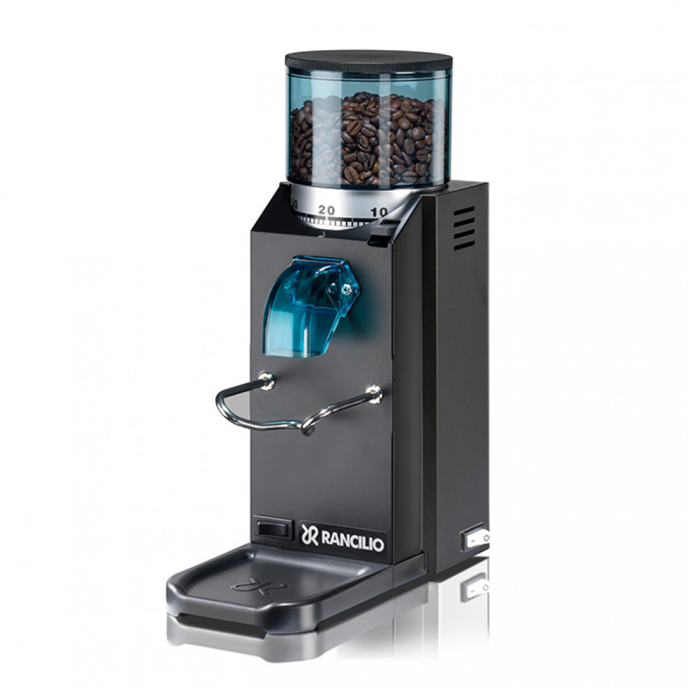

# grinder

DIY project to add timed grind buttons to the [Rancilio
Rocky](https://www.coffeeness.de/en/rancilio-rocky-review/) grinder.

| Rancilie Rocky | after modification |
|:-------------------------------------:|:-------------------------------------:|
|  |  |

## Description

Rancilio Rocky seems to be a nice device, it lasted me the last decade without
problems but it has a major flaw, no way to carry out a timed grind. There are a
few other project out there like this, for me this approach was the most
feasible.

Basic idea is to use a [Raspberry Pi Zero
W](https://www.raspberrypi.com/products/raspberry-pi-zero-2-w/) and some
minimalistic electronics to get buttons that can be used to activate the grinder
for a software controlled amount of time.

## Features

- Control the grinder via physical buttons
- Adjust grind times via a web interface
- Safe and flexible control using GPIO and a Solid State Relay

## Showcase

|  |  |  |
|:------------:|:------------:|:------------:|
|  |  |  |

## Used Components

- [Raspberry Pi Zero
W + an SD Card](https://www.raspberrypi.com/products/raspberry-pi-zero-2-w/)
- [220V auf 5V 1A USB Interface](https://amzn.eu/d/07xP26XJ)
- [Drucktaster](https://amzn.eu/d/0fkwAuz7)
- [24 V-380 V SSR](https://amzn.eu/d/0aPBSthj)

These components are, of course, only a suggestion and what I used for this project.

## Setup Instructions

### Hardware Connections

1. **Connect the Single Grind Button:**
   - One side to GPIO 17
   - The other side to GND
2. **Connect the Double Grind Button:**
   - One side to GPIO 27
   - The other side to GND
3. **Connect the SSR Control Side:**
   - Positive control terminal to GPIO 18
   - Negative control terminal to GND
4. **Connect the SSR Load Side:**
   - One load terminal to the live wire from the mains supply
   - The other load terminal to the live wire of the grinder

 

### Software Setup

Install a light weight [raspian](https://www.raspberrypi.com/software/) on the
SD-Card, I used their Imager tool, which worked great. Directly configure Wifi
and ssh when doing this.

Then login to your `grinder pi` and setup the software.

```bash
git clone https://github.com/guenthereder/grinder.git
cd grinder
python3 -m venv .venv
source .venv/bin/activate
pip install -r requirements.txt
````

Open `grinder_control.service` and adapt it to match your environment.

```bash
sudo cp grinder_control.service /etc/systemd/system
sudo systemctl daemon-reload
sudo systemctl start grinder_control
```

Optional 🙃

```bash
sudo cp motd /etc/
```

### Software Test

If everything is running you should be able to access the Grinder Timer Settings
via browser, just visit [http://pi-grinder.local](http://ginder.local) using the name you gave your pi.

## Warning

**Working with electricity can be dangerous. Ensure all high voltage
connections are handled with care and proper insulation. If you are not
experienced with electrical work, seek assistance from a qualified electrician.
Incorrect wiring can result in electric shock, fire, or damage to equipment.**